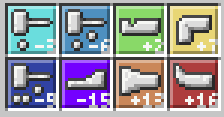

# 🔨 TFCAnvilCalculator

A simple Python tool to help players use the anvil mechanics from the **TerraFirmaCraft** mod for Minecraft.

## 🧰 Features

- Simulates anvil hit sequences to match TerraFirmaCraft recipes
- Easily extensible for new recipes or rule logic
- Includes unit tests (`test_main.py`) for validation

## 📖 About

In **TerraFirmaCraft**, forging items on an anvil requires hitting them in the correct sequence using combinations of Light, Medium, and Heavy hits.
This tool helps players determine the correct hit pattern to successfully complete a recipe.



## 🚀 Getting Started

### Prerequisites

- Python 3.10+

### Installation

1. Clone this repository:
   ```bash
   git clone https://github.com/LeonardoLBraga/TFCAnvilCalculator.git
   cd TFCAnvilCalculator
   ```

2. (Optional) Create a virtual environment:
   ```bash
   python -m venv venv
   source venv/bin/activate  # On Windows: venv\Scripts\activate
   ```

3. Install dependencies (if any are added in the future):
   ```bash
   pip install -r requirements.txt
   ```

### Running

```bash
python main.py
```

### Running Tests

```bash
python test_main.py
```

## 📂 Project Structure

```
├── images/            # Folder for screenshots or diagrams
├── entities.py        # Contains data models or logic entities
├── main.py            # Entry point of the tool
├── test_main.py       # Unit tests for verifying tool logic
├── README.md          # Project documentation
```

## ✅ Example Usage

The script helps calculate a valid sequence of anvil instructions to reach a target forging value.

```python
def main():
    instruction1 = Instruction("draw", Positions.NOT_LAST)
    instruction2 = Instruction("hardhit", Positions.NOT_LAST)
    instruction3 = Instruction("shrink", Positions.LAST)

    targetValue = 40

    mandatory_instructions = [instruction1, instruction2, instruction3]

    instructionsFinal = CalculateInstructions(mandatory_instructions, targetValue)
    print("final_instruction: ", instructionsFinal)
```

This example defines a set of required forging instructions and calculates a valid sequence of hits that results in the target value of `40`, ensuring that the last move is `shrink` and the others appear before it.

## 💡 Future Improvements

- 🔧 Add command-line arguments to allow users to input custom instructions and target values
- 📊 Improve result explanation with step-by-step breakdown of calculations
- 🌐 Build a simple web or GUI interface using Flask or Tkinter for usability
- 📁 Allow importing/exporting recipes from/to JSON or CSV files
- 🌍 Add internationalization support for multiple languages (EN, PT-BR, etc.)
- 🧪 Add property-based testing (e.g., with Hypothesis) for better test coverage
- 🧠 Integrate logic explanation or AI-assist mode to suggest how and why a sequence is chosen

## 📄 License

This project is licensed under the [LICENSE](LICENSE).
